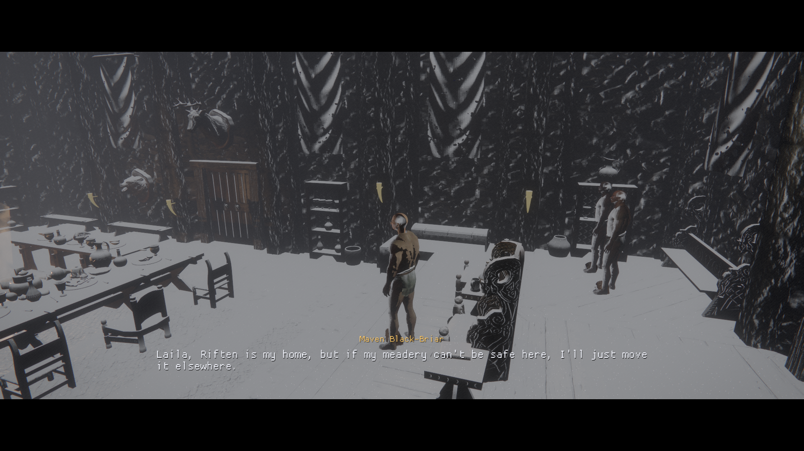
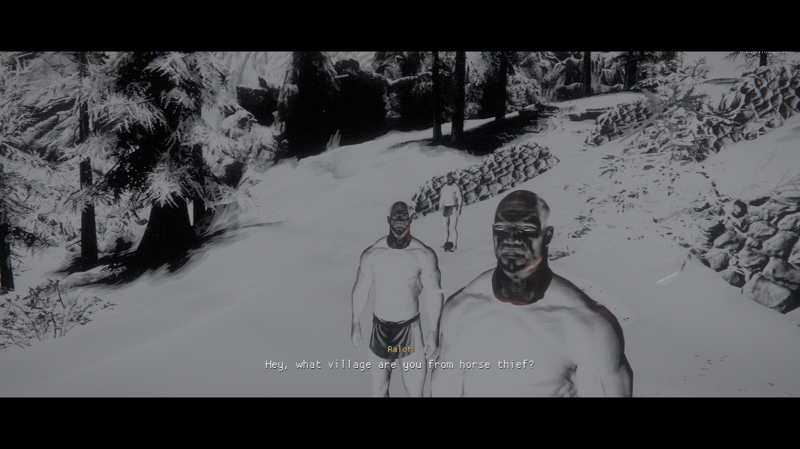
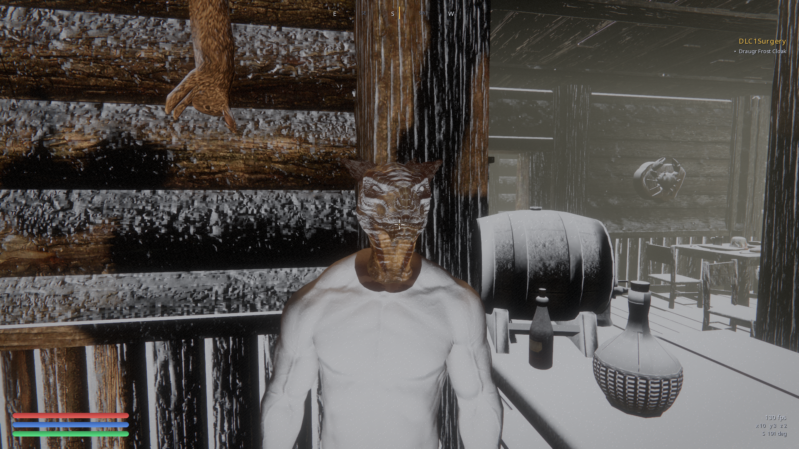

# Cutscenes

Skyrim's cutscenes are not movies. There is no camera data, no timeline, no baked
animation for a conversation: a cutscene is a **SCEN record**, which is a cast of
quest aliases, a list of phases, and per-phase actions (speak a line, run an AI
package, wait). The game plays each line for exactly as long as its voice recording,
frames whoever is speaking procedurally, and moves actors by handing them packages.
The opening cart ride into Helgen is that and nothing more: travel packages on a
horse's alias, a cart towed by its enable parent, prisoners held in place by a
no-travel package, and a 29-phase scene speaking 20 lines over the top.

So the engine plays cutscenes by running that machinery, not by scripting scenes:

| System | Where | What it does |
| --- | --- | --- |
| Scene phase machine | `engine/quest/scene_runtime.{h,cc}` | Lowers a parsed SCEN into a `ScenePlan` and drives it: phases in order, one line at a time for its full length, packages held across their phase window, phase completion gated on the record's CTDA (with a timeout so an unreachable gate cannot wedge a scene). Pure, unit tested (`scene_runtimetest`). |
| Dialogue camera | `components/world/cine_camera.{h,cc}` | The shot language: over-shoulder, reverse, two-shot, close-up, wide, solved from the speaker's and listener's head positions, plus a cutting policy that cuts on a new speaker, holds a minimum, and breaks up a long speech. Pure, unit tested (`cine_cameratest`). |
| Voice + pacing | `engine/dialogue/voice.{h,cc}` | Indexes the voice archive by the INFO id every file name carries, so a line finds its recording even when the clip was exported under another quest's name, and reads the clip's exact length out of the xWMA header, so a scene is paced by the recording. Unit tested (`voicetest`). |
| AI packages | `runtime/actor/ai_package_director.{h,cc}` | Runs the alias package stacks: picks the first package whose conditions pass, walks travel packages to their target, fires the package's Papyrus fragment on arrival, tows objects behind the actor they are enable-parented to, and carries riders (with the vehicle's seated idles) on a moving cart. |
| Cutscene director | `runtime/narrative/cutscene_director.{h,cc}` | The live layer: indexes every SCEN by owning quest, starts scenes the way the game does, plays their lines (voice + caption + the INFO's own Papyrus fragment), fires the SCEN phase fragments that advance the journal, hands scene packages to the package driver, switches on cast that is still disabled, and drives the camera. |
| Quest mirror | `runtime/narrative/quest_state_cache.h` | A main-thread mirror of live quest state (stage, running, stages done) so the systems that own the world can evaluate the records' condition gates without marshalling onto the Papyrus guest thread. |

## How a scene starts

The same two ways the game starts one:

* **`Scene.Start` from Papyrus.** A quest stage fragment calls `MyScene.Start()`
  (MQ101 alone does this for 14 of its scenes). The native queues the call for the
  main thread, because playing a scene means moving actors, playing audio and taking
  the camera. `Scene.Stop` / `Scene.IsPlaying` answer against live playback.
* **The "begin on quest start" flag.** 956 of the game's 2130 scenes carry SCEN
  flag `0x01` and need no script at all: they start when their quest comes online.
  Skyrim's cart ride (`MQ101Scene1`) is one of them, and so is nearly every ambient
  town conversation.

## Running one

```
RX_CUTSCENE=MQ101 ./run-skyrim.sh          # start a quest and watch its scenes
RX_CUTSCENE=DialogueRiftenKeepScene11 ./run-skyrim.sh --interior RiftenMistveilKeep
RX_CUTSCENE_REPORT=MQ1 ./build/nix/runtime/recreation --headless --data-dir <Data>
```

| Knob | Default | Effect |
| --- | --- | --- |
| `RX_CUTSCENE=<quest editor id>` | off | Starts that quest at load, boots the world where its first scene plays, and lets its scenes take the camera at any range (any quest, scripted or not). |
| `RX_CUTSCENE_REPORT=<prefix\|all>` | off | Headless: lowers every matching quest's scenes and reports cast, phases, beats, spoken lines, voiced lines, package beats, running time and where the scene plays. |
| `RX_SCENE_CAMERA` | on | The dialogue camera. Off leaves scenes playing in the gameplay view. |
| `RX_SCENE_VOICE` | on | Voice playback. Off falls back to reading-time pacing. |
| `RX_SCENE_LETTERBOX` | on | Cinematic bars while a scene owns the view. |
| `RX_CUTSCENE_SOAK=<n>` | off | Plays **every** scene in the game live, n at a time, on a short clock (no clips): the sweep reports how many started, how many spoke, and which had a line and never said it. This is the whole-game verification pass. |
| `RX_CAPTURE_OFFSCREEN=1` | off | Renders captures offscreen, for screenshots on an unattended desktop (a compositor that stops compositing the window otherwise hands back a garbage frame). |

Esc hands the camera back mid-scene; the scene keeps playing.

## Coverage

`RX_CUTSCENE_REPORT=all` over Skyrim + Update + Dawnguard + HearthFires + Dragonborn:

```
2130 scene(s) over 1281 quest(s), 956 begin with their quest
8329 spoken line(s), 7151 with a voice clip (86%)
  12 of the rest name a clip the archives do not hold; the other 1167 have no
  recording anywhere, which is how Skyrim ships them (subtitle only)
4820 performer(s), 3999 bound to a reference by the records alone
  1778 scenes have their whole cast bound, 217 none (those fill at runtime)
```

Every one of those 2130 scenes lowers to a runnable plan: phases sorted, cast
resolved through the quest's alias table, dialogue resolved to real INFO records and
subtitle text, packages resolved to PACK handles, phase gates transpiled from CTDA.
An unvoiced line still plays, timed by its reading length.

And every one of them has been **played**, not just lowered. `RX_CUTSCENE_SOAK=24`
runs the whole game's scenes through the live director, 24 at a time:

```
this run started 2130 scene(s), 1919 spoke a line, over 1226 quest(s)
2 scene(s) had a line and did not speak it: DLC1VQ08PostGaranScene, DLC1VQ08PostIsranScene
```

209 of the 211 that stay silent have no dialogue at all: they are package or timer
scenes (an actor walks somewhere, a scene waits). The other two are Dawnguard scenes
that stop themselves through their own Papyrus a beat after they start, which is the
game's own logic running, not a scene that failed to play. Nothing crashed, and the
sweep exits on its own.



`RiftenKeepScene11` playing in Mistveil Keep: the scene started itself with its
quest, the dialogue camera framed the exchange, and the caption is the INFO's own
text under the speaker's real name, timed by her voice clip.



`MQ101Scene1`, the opening cart ride, on the mountain road above Helgen: the scene
started itself with the quest, the dialogue camera cut to the prisoners where it stages
them, and they speak the opening exchange in the authored order with their voice clips.

## Verified quests

"Played live" means the engine was run on the real game data, the scene started
itself, its lines were spoken in the authored order with their voice clips, and the
journal moved where the scene's fragments move it. "Content verified" means the same
data path was exercised headlessly by the coverage report (cast, phases, lines,
clips, packages all resolved) without a live playthrough of that quest.

| Quest | Name | Scenes | Lines | Voiced | Status | Evidence |
| --- | --- | --- | --- | --- | --- | --- |
| MQ101 | Unbound | 17 | 197 | 152 | Played live | `MQ101Scene1` (29 phases) speaks the whole cart ride in order, from "Hey, you. You're finally awake." to "Sovngarde awaits."; journal runs 0 -> 10 -> 15; the cart horse runs its patrol packages and tows the cart; the cast is framed and captioned on screen (screenshot above) |
| DialogueRiftenKeepScene11 | Riften Keep Scene 11 | 1 | 10 | 10 | Played live | Laila and Maven's audience plays on entering Mistveil Keep, voiced |
| DialogueRiftenBeeAndBarbScene01 | Bee and Barb Scene 01 | 1 | 4 | 4 | Played live | Talen-Jei and Keerava behind the bar, framed and voiced (screenshot below) |
| MG01 | First Lessons | 7 | 43 | 43 | Played live | Mirabelle/Ancano scene starts with the quest and speaks its lines |
| DialogueMorthalInitialScene | Morthal | 1 | 7 | 0 | Played live | Jorgen/Thonnir/Aslfur argue in Highmoon Hall (unvoiced, reading-time paced) |
| DialogueRiftenSS02Scene | Riften | 1 | 4 | 4 | Played live | Mjoll and Aerin on the Thieves Guild |
| DialogueIvarsteadSSScene | Ivarstead | 1 | 4 | 0 | Played live | Klimmek and Gwilin on the 7000 Steps |
| DialogueRiftenMaul | Riften Maul | 1 | 1 | 1 | Played live | Maul's forcegreet scene starts and completes |
| T01 | The Book of Love | 1 | 2 | 2 | Played live | Markarth Temple of Dibella protocol scene |
| MS08 | In My Time Of Need | 5 | 12 | 9 | Played live | `RJBanditScene` plays in Swindlers Den with its cast framed and upright |
| CW00SolitudeMapTableScene | Civil War council | 1 | 15 | 14 | Played live | Legate Rikke opens the war-table scene in Castle Dour ("Ulfric's planning an attack on Whiterun") and the camera takes it |
| MQ302 | Season Unending | 26 | 178 | 170 | Content verified | Report: every scene of the peace council lowers, 170 clips resolve |
| MQ104 | Dragon Rising | 7 | 99 | 59 | Content verified | |
| MQ203 | Alduin's Wall | 5 | 82 | 79 | Content verified | |
| MQ201 | Diplomatic Immunity | 10 | 57 | 49 | Content verified | Party scenes carry their own quest (`MQ201Party`, 7 scenes) |
| MQ206 | Alduin's Bane | 2 | 53 | 48 | Content verified | |
| MQ105 | The Way of the Voice | 5 | 46 | 44 | Content verified | |
| CW02A/B | The Jagged Crown | 15 | 133 | 99 | Content verified | |
| CW03 | Message to Whiterun | 3 | 73 | 45 | Content verified | Includes `CW03SiegeScene` (29 phases) |
| MG07 | The Staff of Magnus | 18 | 86 | 77 | Content verified | |
| MS04 | Unfathomable Depths | 13 | 50 | 50 | Content verified | |
| DarkBrotherhood | Dark Brotherhood | 6 | 42 | 42 | Content verified | |
| TG08B | Thieves Guild | 19 | 43 | 42 | Content verified | |
| DLC2SV01 | Dragonborn (Skaal) | 27 | 64 | 64 | Content verified | |
| DialogueWhiterun | Whiterun City Dialogue | 9 | 48 | 48 | Content verified | The town's ambient conversations |

`RX_HELGEN_INTRO` (the hand-directed cart ride that predates this) still exists and
still runs; it spawns its own cart, horse and riders instead of using the placed
references, and the records-driven scene above has replaced it.



`RiftenBeeAndBarbScene01`: Talen-Jei mid-line in the inn, on the shot the director
picked. His four lines were unvoiced until the archive index went in.

## Fixed along the way

The frame's skinning palette is a fixed budget (8192 matrices) and a dense exterior
holds more actors than fits; whoever overflowed it drew from memory nothing had
written. Actors are now emitted nearest-camera-first and the loop stops at the
budget, so the ones on screen are the ones that get skinned.

The cutscene camera also lifts until its line to the subject is clear, so a shot
solved off two heads on a slope does not frame the hillside in front of them.

A cutscene's cast used to vanish mid-scene. A scene stages its performers by
teleporting them onto markers, often a cell or two from where they were authored, and
the streamer deleted every reference the moment its *authored* cell left the ring, no
matter where the reference actually stood. Skyrim's whole Helgen cast was destroyed a
few seconds into its own cutscene, which is why the camera had nothing to frame. A
reference that has moved out of its cell is now carried by the streamer for as long as
it is inside the streamed ring (and released once it leaves), and a reference that is
already live is not placed a second time when its authored cell streams back in. Travel
packages that walk an actor across a cell boundary rest on the same rule.

The camera also sticks to the scene it is already on while that scene is still
speaking; a quest with seventeen simultaneous scenes (MQ101) otherwise cuts between
them mid-line and drags the streamed world across the map with it.

Localized text was resolved from one flat table for the whole load order, but a
string id is only unique inside its own plugin, so every Dawnguard, HearthFires and
Dragonborn string collided with a base-game id and lost. Captions attributed lines to
"Glass Greatsword of Expelling" and read back item names and race descriptions. The
string table is keyed per plugin now, and a record's text resolves against the plugin
that wrote it; that fixes DLC naming everywhere, not only in cutscenes. Alongside it,
a speaker name only comes from a placed actor or an NPC record, so an alias filled
with an object cannot caption a line.

Every placed actor in every game was lying on its back. A REFR's rotation was
converted with the axis change that turns Bethesda's Z-up space into the engine's
Y-up, but a skinned actor already converts its Bethesda-space skeleton itself, so the
two composed and tipped the body 90 degrees. Placed actors now carry a plain yaw
about engine up (the only axis the games rotate an actor about), and the shared NPC
template holds the game's own standing idle (`mt_idle_a_base.hkx`) instead of the
procedural gait, which is authored against the builtin biped's bones.

## Known gaps

* 12 lines name a clip the archives do not hold. They play, paced by their reading
  length. (The other 1371 unvoiced lines are not a gap: Skyrim ships no audio for
  them either, and showing the subtitle for its reading length is what the game does.)
* **217 scenes bind no cast from the records.** Forced references (ALFR), unique
  actors (ALUA), created objects (ALCO) and external alias references (ALEQ/ALEA,
  which is how the conversation quests share one cast) all resolve, and a
  find-matching alias (ALFA, "any reference of this ref type in this location") is
  filled from the location's ref-type table, walking up its parent chain. What is
  left fills from Papyrus at runtime (`ForceRefTo` as the quest reaches the scene),
  so those scenes bind when the quest that owns them actually runs, and play as voice
  and subtitles in the gameplay view when it has not.
* **The cart ride stops after its first leg.** The horse walks `MQ101CartHorse1Patrol1`
  and arrives; the next leg is gated on a journal stage that vanilla reaches with
  the player aboard the cart tripping the quest's own triggers. Riding the cart as
  the player is the missing gameplay path, not a missing system.
* **Phase completion conditions** are evaluated against the main-thread quest mirror.
  The game's scenes carry 2132 phase-gate conditions: the mirror answers `GetStage`
  (117), `GetStageDone` (312) and `GetDistance` (267) exactly, and the rest read as 0
  and fall to the phase timeout, so the scene still finishes but on the timeout rather
  than on its cue. The single biggest group is CK function 550 (907 of them), which
  reads a quest's Papyrus script variables: answering those means mirroring script
  state onto the main thread, the same way stage state is mirrored today.
