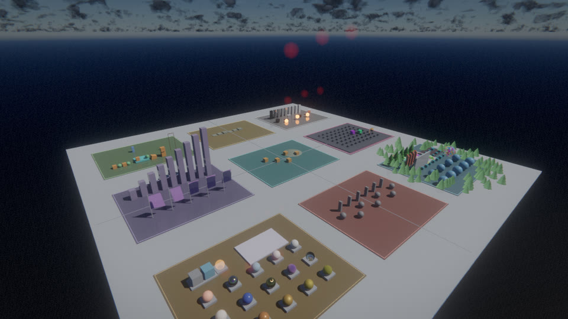
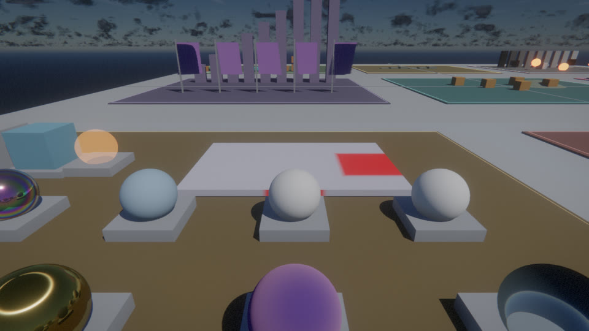
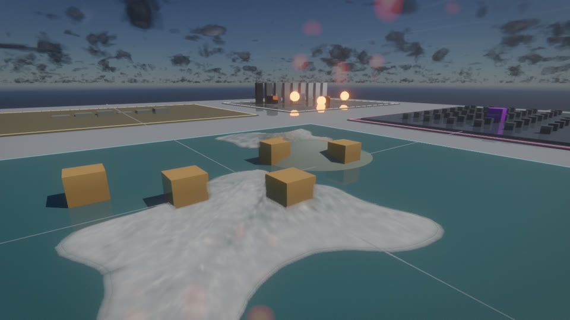
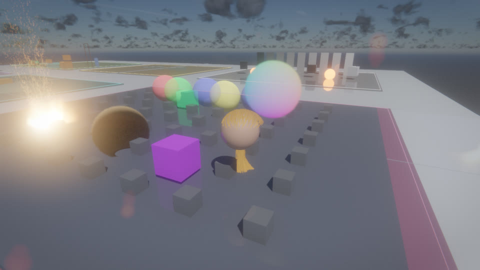
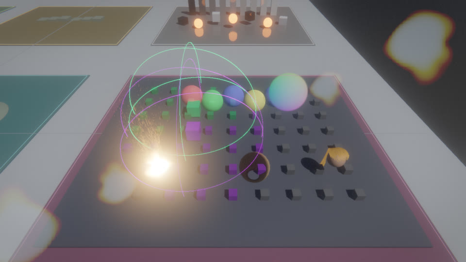

# RX Feature Gym

`--demo featuregym` is a self-contained acceptance world for RX. All geometry is
procedural and all texture/audio inputs are generated by `generate_assets.py`;
the gym has no game-data or downloaded-asset dependency.

The nine districts cover materials, local lighting, geometry scalability,
atmosphere/weather, water, special effects, physics, animation, and temporal/post
processing. Hardware-dependent features remain enabled through RX's normal
capability fallbacks, so the same world starts on raster-only and RT-capable GPUs.
The lighting tour includes RCGI; launch with `--no-rt` or `RX_RCGI_SW=1` to run
that stop through the software SDF tracer instead of hardware ray queries.

The 28-stop tour also exercises streamed instance-group replacement, split PBR
maps with per-submesh materials, eight-layer terrain splatting, projected virtual
geometry albedo, Gerstner shoreline buoyancy, Jolt strand grooming, local network
interest bubbles, and ECS camera-stack transitions. Network visualization is
compiled only when `RECREATION_NET` is enabled; strand dynamics fall back to the
authored groom when Jolt is unavailable.

Regenerate the binary inputs after changing the generator:

```sh
python3 runtime/feature_gym/generate_assets.py
```

CMake copies these assets beside desktop/server binaries, and the Android build
packages them through the APK asset manager. Set `RECREATION_FEATURE_GYM_ASSET_DIR`
to override the desktop lookup root.

Run the deterministic camera pass and capture every stop:

```sh
RX_FIXED_DT=0.016666667 build/linux/runtime/recreation --demo featuregym \
  --feature-tour --feature-tour-shots build/feature-gym-shots --feature-tour-quit
```

`tests/feature_gym/tour.py` wraps that command and rejects missing, black, or
uniform captures.

## Captures










